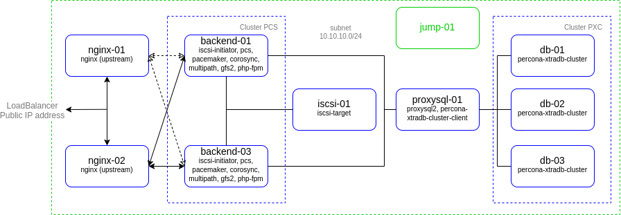
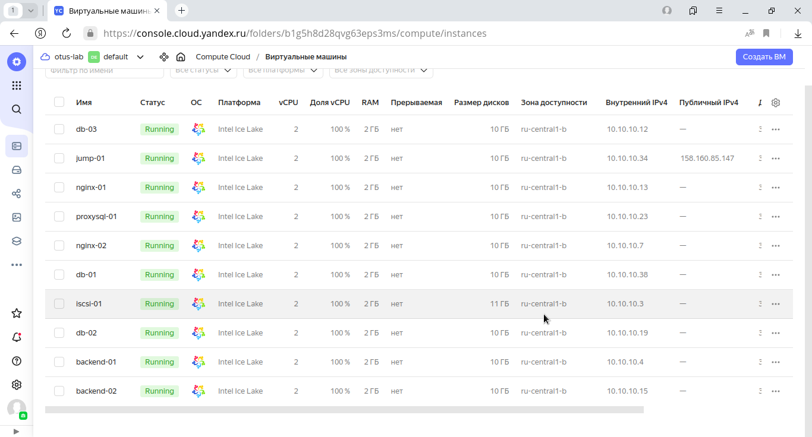

# lab-05
otus | mysql cluster

### Домашнее задание
Развернуть InnoDB или PXC кластер

#### Цель:
Перевести базу веб-проекта на один из вариантов кластера MySQL: Percona XtraDB Cluster или InnoDB Cluster.

#### Описание/Пошаговая инструкция выполнения домашнего задания:
1. Разворачиваем отказоустойчивый кластер MySQL (PXC || Innodb) на ВМ или в докере любым способом
2. Создаем внутри кластера вашу БД для проекта

#### Критерии оценки:
Статус "Принято" ставится при выполнении описанного требования.


### Выполнение домашнего задания

#### Создание стенда

Стенд будем разворачивать с помощью Terraform на YandexCloud, настройку серверов будем выполнять с помощью Ansible.

Необходимые файлы размещены в репозитории GitHub по ссылке:
```
https://github.com/SergSha/lab-05.git
```

Схема:



Для начала получаем OAUTH токен:
```
https://cloud.yandex.ru/docs/iam/concepts/authorization/oauth-token
```

Настраиваем аутентификации в консоли:
```
export YC_TOKEN=$(yc iam create-token)
export TF_VAR_yc_token=$YC_TOKEN
```

Скачиваем проект с гитхаба:
```
git clone https://github.com/SergSha/lab-05.git && cd ./lab-05
```

В файле provider.tf нужно вставить свой 'cloud_id':
```
cloud_id  = "..."
```

При необходимости в файле main.tf вставить нужные 'ssh_public_key' и 'ssh_private_key', так как по умолчанию соответсвенно id_rsa.pub и id_rsa:
```
ssh_public_key  = "~/.ssh/id_rsa.pub"
ssh_private_key = "~/.ssh/id_rsa"
```

Для того чтобы развернуть стенд, нужно выполнить следующую команду:
```
terraform init && terraform apply -auto-approve && \
sleep 60 && ansible-playbook ./provision.yml
```

На всех серверах будут установлены ОС Almalinux 8, настроены смнхронизация времени Chrony, система принудительного контроля доступа SELinux, в качестве firewall будет использоваться NFTables.

Стенд был взят из лабораторной работы 4 https://github.com/SergSha/lab-04, только вместо одного сервера для базы данных, будет кластер, состоящий из серверов db-01, db-02 и db-03. Балансировщиком нагрузки для распределения пакетов между серверами кластера базы данных будет служить сервер proxysql-01, в котором установлено приложение ProxySQL2. Для создания кластера базы данных будем использовать Percona XtraDB Cluster.

Так как на YandexCloud ограничено количество выделяемых публичных IP адресов, в дополнение к этому стенду создадим ещё один сервер jump-01 в качестве JumpHost, через который будем подключаться по SSH (в частности для Ansible) к другим серверам той же подсети.

Список виртуальных машин после запуска стенда:



Для проверки работы стенда воспользуемся отображением простой страницы собственноручно созданного сайта на PHP, 
имитирующий продажу новых и подержанных автомобилей:


Значение IP адреса сайта получен от балансировщика от YandexCloud:


При напонении сайта данные будут размещаться в базе данных кластера серверов db-01, db-02, db-03. На данном кластере, как и ранее заявлялось, установлено приложение Percona XtraDB Cluster.
Заранее создана база данных 'cars', в котором созданы таблицы 'new' и 'used', имитирующие списки соответственно новых и подержанных автомобилей.

Начнём наполнять этот сайт:


Отключим одну виртуальную машину из балансировщиков, например, nginx-01:


Обновим страницу:


Продолжим наполнять сайт:


Как видим, сайт работает без балансировщика nginx-01.
